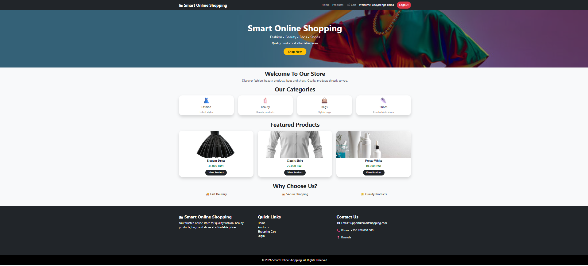
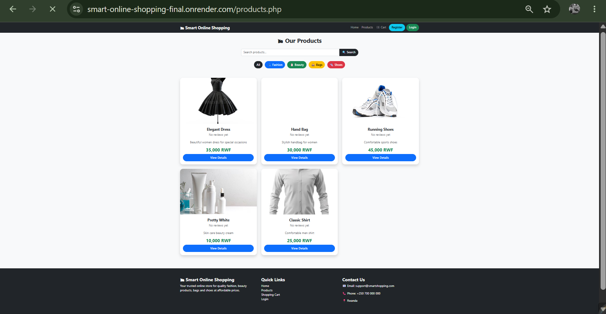
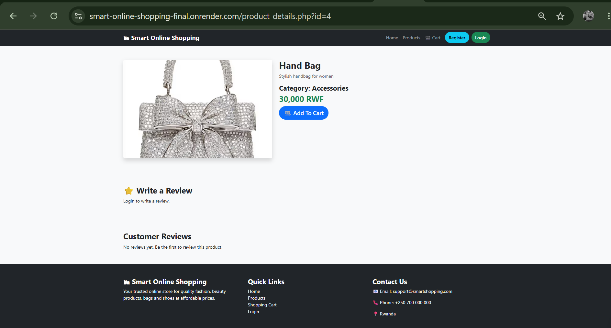
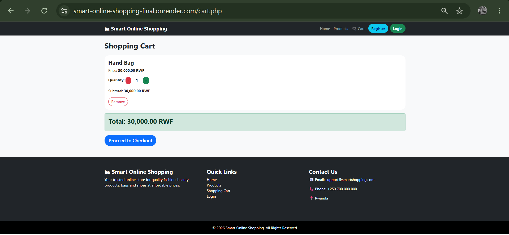
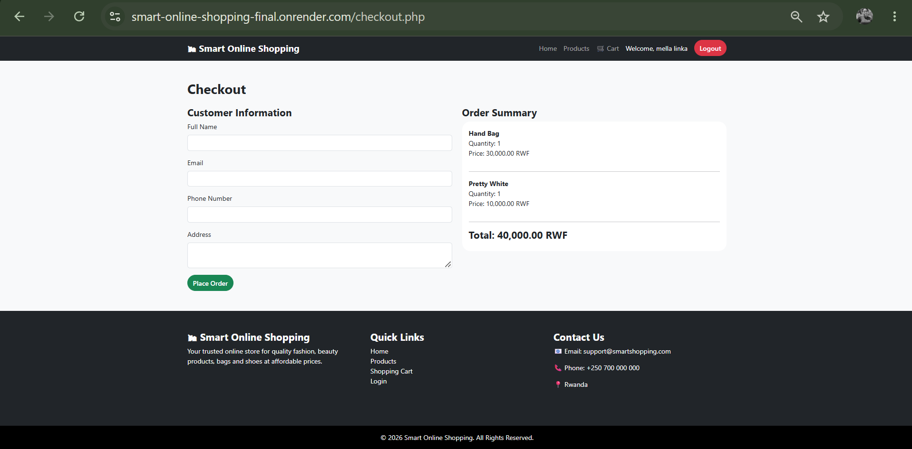
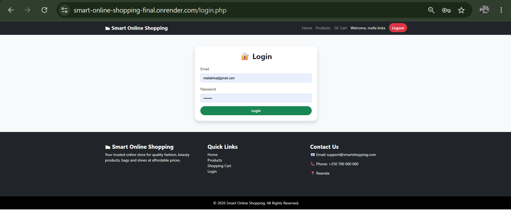
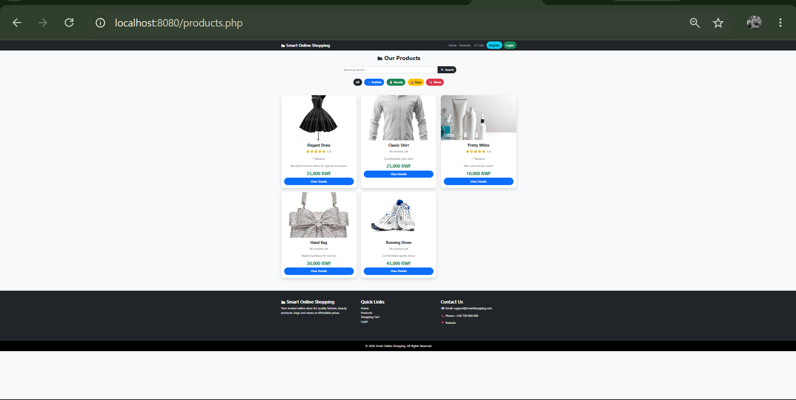
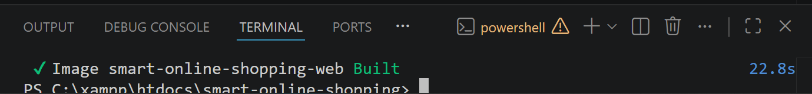
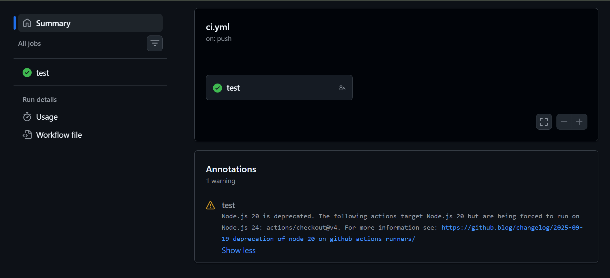

# Smart Online Shopping System


---

# Table of Contents

* [Live Application](#live-application)
* [Project Overview](#project-overview)
* [Objectives](#objectives)
* [System Features](#system-features)
* [Technologies Used](#technologies-used)
* [System Architecture](#system-architecture)
* [Database Design](#database-design)
* [Project Structure](#project-structure)
* [Application Screenshots](#application-screenshots)
* [Local Installation](#local-installation)
* [Docker Implementation](#docker-implementation)
* [CI/CD Pipeline](#cicd-pipeline)
* [Cloud Deployment](#cloud-deployment)
* [Security Implementation](#security-implementation)
* [Testing](#testing)
* [Future Improvements](#future-improvements)
* [Author](#author)
* [Acknowledgement](#acknowledgement)

---

# Live Application

## Website URL

🌐 https://smart-online-shopping-final.onrender.com

---

# Project Overview

Smart Online Shopping System is a full-stack e-commerce web application developed to provide customers with a simple, secure, and convenient platform for purchasing products online.

The system allows users to create accounts, authenticate themselves, browse products, search products, add items to a shopping cart, complete checkout, and manage their orders.

This project demonstrates practical skills in:

* Full-stack web development
* Database management
* Cloud deployment
* Docker containerization
* GitHub version control
* Continuous Integration and Continuous Deployment (CI/CD)

---

# Objectives

The main objectives of this project are:

* To develop an online shopping platform.
* To provide customers with easy access to products.
* To implement secure user authentication.
* To manage products, customers, and orders efficiently.
* To store application data using a relational database.
* To deploy the application on a cloud platform.
* To apply DevOps practices using Docker and GitHub Actions.

---

# System Features

## Customer Features

Customers can:

* Create an account
* Login and logout
* Browse available products
* Search products
* Filter products by category
* View product details
* Add products to cart
* Update cart items
* Checkout orders
* View order history
* Submit product reviews

## Administrator Features

Administrators can:

* Access admin dashboard
* Add products
* Update products
* Delete products
* Manage categories
* View customer orders
* Update order status

---

# Technologies Used

## Frontend

* HTML5
* CSS3
* Bootstrap 5
* JavaScript

## Backend

* PHP 8.2

## Database

Development:

* MySQL / MariaDB using XAMPP

Production:

* TiDB Cloud (MySQL compatible)

## Server

* Apache

## Deployment

* Render Cloud Platform

## DevOps Tools

* Git
* GitHub
* GitHub Actions
* Docker
* Docker Compose

---

# System Architecture

The application follows a three-layer architecture:

```
User Browser
      |
      |
Frontend Interface
      |
      |
PHP Backend
      |
      |
Database Server
```

## Deployment Architecture

```
Developer
     |
     |
GitHub Repository
     |
     |
GitHub Actions CI
     |
     |
Render Cloud Platform
     |
     |
Live Application
```

## Docker Architecture

```
PHP Apache Container
          |
          |
Database Container
```

---

# Database Design

Database Name:

```
smart_online_shop
```

## Main Tables

| Table       | Description                                   |
| ----------- | --------------------------------------------- |
| users       | Stores customer and administrator information |
| categories  | Stores product categories                     |
| products    | Stores available products                     |
| orders      | Stores customer orders                        |
| order_items | Stores products inside orders                 |
| reviews     | Stores customer reviews                       |

## Relationships

* One category contains many products.
* One user can create many orders.
* One order contains many order items.
* Users can review products.

---

# Project Structure

```
smart-online-shopping/

│
├── assets/
│   └── images/
│
├── config/
│   └── database.php
│
├── includes/
│   ├── header.php
│   ├── Navbar.php
│   └── footer.php
│
├── admin/
│
├── screenshots/
│
├── index.php
├── login.php
├── register.php
├── products.php
├── product_details.php
├── cart.php
├── checkout.php
│
├── Dockerfile
├── docker-compose.yml
├── README.md
└── PROJECT_REPORT.md
```

---

# Application Screenshots

## Homepage

The homepage displays:

* Website banner
* Product categories
* Featured products



---

## Products Page

Features:

* Product browsing
* Search functionality
* Category filtering



---

## Product Details

Displays:

* Product information
* Product price
* Description
* Add to cart option



---

## Shopping Cart

Customers can:

* View selected products
* Update quantities
* Check total price



---

## Checkout

Customers can complete their orders.



---

## Login System

The authentication system provides:

* User registration
* Login functionality
* Secure access control



---

## Localhost Deployment

The application running successfully on the local development server.



---

## Docker Deployment

The project was containerized using Docker.



---

## GitHub Actions CI/CD

The CI/CD pipeline automatically validates the project after code changes.



---

# Local Installation

## Requirements

Install:

* XAMPP
* PHP 8.2+
* MySQL
* Web Browser

## Installation Steps

Clone repository:

```bash
git clone https://github.com/Rhiannonsurfstore/smart-online-shopping-final.git
```

Move project to:

```
C:\xampp\htdocs\
```

Start XAMPP services:

```
Apache
MySQL
```

Create database:

```
smart_online_shop
```

Import the SQL database file.

Open:

```
http://localhost/smart-online-shopping
```

---

# Docker Implementation

The application is containerized using Docker.

## Docker Components

### Web Container

Contains:

* PHP 8.2
* Apache Server
* Application files

### Database Container

Contains:

* MySQL Database

## Docker Commands

Build container:

```bash
docker compose build
```

Run application:

```bash
docker compose up
```

Application URL:

```
http://localhost:8080
```

---

# CI/CD Pipeline

GitHub Actions is used for Continuous Integration.

The pipeline performs:

1. Download project source code.
2. Setup PHP environment.
3. Validate PHP files.
4. Check project build.

Workflow file:

```
.github/workflows/ci.yml
```

Pipeline:

```
Code Push
     |
     |
GitHub Actions
     |
     |
PHP Validation
     |
     |
Successful Build
```

Status:

✅ Smart Online Shopping CI Successful

---

# Cloud Deployment

The application is deployed using:

## Hosting Platform

Render Web Service

Website:

```
https://smart-online-shopping-final.onrender.com
```

## Production Database

TiDB Cloud

Database connection uses environment variables:

```
DB_HOST
DB_PORT
DB_USER
DB_PASSWORD
DB_NAME
```

The database connection is secured using SSL/TLS.

---

# Security Implementation

Implemented security features:

* Password hashing
* Prepared SQL statements
* Input validation
* Protected database credentials
* Secure database connection
* User authentication

---

# Testing

The following tests were completed:

✅ User registration

✅ Login authentication

✅ Product display

✅ Product search

✅ Shopping cart

✅ Checkout process

✅ Order creation

✅ Database connection

✅ Docker deployment

✅ Cloud deployment

✅ CI/CD workflow

---

# Project Report

A detailed project report is available:

```
PROJECT_REPORT.md
```

The report includes:

* Introduction
* Problem statement
* Objectives
* System architecture
* Database design
* Deployment process
* Docker implementation
* CI/CD implementation
* Challenges
* Future improvements

---

# Future Improvements

Possible future enhancements:

* Mobile Money payment integration
* AI product recommendations
* Email notifications
* Mobile application development
* Advanced analytics dashboard
* Real-time order tracking

---

# Author

**Abayisenga Ziripa**

Software Engineering Student

E-Commerce and Web Application Project

Academic Year: 2025/2026

---

# Acknowledgement

This project was developed as part of the E-Commerce and Web Application course.

It demonstrates practical knowledge in:

* Full-stack web development
* Database management
* Cloud deployment
* Docker containerization
* GitHub version control
* CI/CD automation
